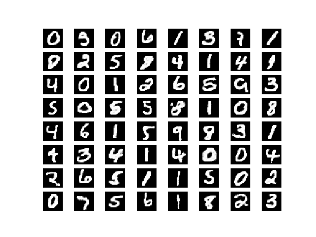

# Restricted Blotzmann Machine tensorflow implementaion
for more info please look at 

# Prerequisite
- tensorlfow
- numpy
- matplotlib

# Introduction 
The tf_rbm_grad_mnist.py is the implemention of the RBM model training by
using the gradient of tensorflow. In this implementation instead of computing contrastive divergence we take the gradient of free energy.
The output is:
```
'Epoch:', '0001', 'cost=', '-11.031985820', 'Rec=', '93.640361557')
('Epoch:', '0002', 'cost=', '-5.357300692', 'Rec=', '61.100071356')
('Epoch:', '0003', 'cost=', '-2.281226973', 'Rec=', '54.492744141')
('Epoch:', '0004', 'cost=', '-0.696209217', 'Rec=', '50.629962290')
('Epoch:', '0005', 'cost=', '0.407447510', 'Rec=', '47.777744189')
('Epoch:', '0006', 'cost=', '1.161700661', 'Rec=', '45.492580726')
('Epoch:', '0007', 'cost=', '1.822322554', 'Rec=', '43.539708009')
('Epoch:', '0008', 'cost=', '2.261482377', 'Rec=', '41.994871618')
('Epoch:', '0009', 'cost=', '2.784052290', 'Rec=', '40.605326184')
('Epoch:', '0010', 'cost=', '2.994926203', 'Rec=', '39.485417092')
('Epoch:', '0011', 'cost=', '3.468742454', 'Rec=', '38.674526395')
('Epoch:', '0012', 'cost=', '3.505714444', 'Rec=', '37.705289959')
('Epoch:', '0013', 'cost=', '3.719573975', 'Rec=', '37.000508097')
('Epoch:', '0014', 'cost=', '3.960703902', 'Rec=', '36.366326225')
('Epoch:', '0015', 'cost=', '4.094091020', 'Rec=', '35.853799078')
('Epoch:', '0016', 'cost=', '4.086978427', 'Rec=', '35.099308184')
('Epoch:', '0017', 'cost=', '4.352451061', 'Rec=', '34.818235474')
('Epoch:', '0018', 'cost=', '4.359591730', 'Rec=', '34.342762746')
('Epoch:', '0019', 'cost=', '4.385513805', 'Rec=', '33.889726347')
('Epoch:', '0020', 'cost=', '4.505926070', 'Rec=', '33.529090150')
Optimization Finished!
```

<p align="center">
  
</p>